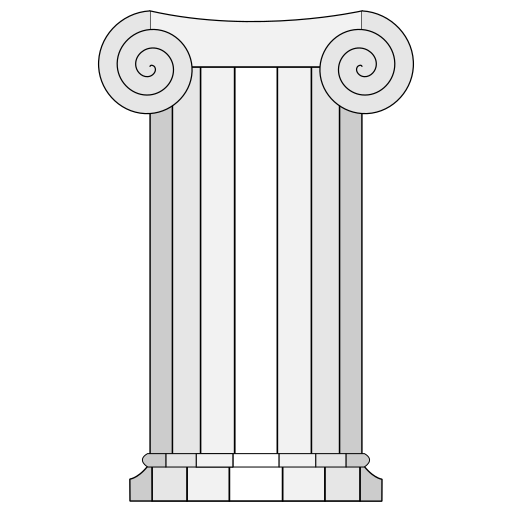

[repo]: https://github.com/threadexio/zeus
[commits]: https://github.com/threadexio/zeus/commits/dev
[releases]: https://github.com/threadexio/zeus/releases
[latest-release]: https://github.com/threadexio/zeus/releases/latest
[issues]: https://github.com/threadexio/zeus/issues
[actions]: https://github.com/threadexio/zeus/actions
[build]: https://github.com/threadexio/zeus/actions/workflows/build.yaml
[license]: https://github.com/threadexio/zeus/blob/master/LICENSE
[pkg-aur]: https://aur.archlinux.org/packages/zeus
[pkg-bin-aur]: https://aur.archlinux.org/packages/zeus-bin
[help]: https://github.com/threadexio/zeus/pulls

<!---->

[pkg-bin-aur]: https://aur.archlinux.org/packages/zeus-bin
[build-badge]: https://img.shields.io/github/workflow/status/threadexio/zeus/Build?style=for-the-badge
[release-badge]: https://img.shields.io/github/v/release/threadexio/zeus?style=for-the-badge&display_name=release
[release-commit-badge]: https://img.shields.io/github/commits-since/threadexio/zeus/latest/dev?logo=github&style=for-the-badge
[license-badge]: https://img.shields.io/github/license/threadexio/zeus?style=for-the-badge
[issues-badge]: https://img.shields.io/github/issues-raw/threadexio/zeus?style=for-the-badge
[pkg-aur-badge]: https://img.shields.io/aur/version/zeus?style=for-the-badge&label=AUR
[pkg-bin-aur-badge]: https://img.shields.io/aur/version/zeus-bin?style=for-the-badge&label=AUR
[help-badge]: https://img.shields.io/badge/HELP-WANTED-green?style=for-the-badge&logo=github

<div align="center">



<h1>
	<b>zeus</b>
</h1>

**<kbd>[Releases][releases]</kbd>** &nbsp; &nbsp; &nbsp;
**<kbd>[CI][actions]</kbd>** &nbsp; &nbsp; &nbsp;
**<kbd>[Issues][issues]</kbd>** &nbsp; &nbsp; &nbsp;
**<kbd>[Usage](#usage)</kbd>** &nbsp; &nbsp; &nbsp;
**<kbd>[Installing](#installing)</kbd>** &nbsp; &nbsp; &nbsp;
**<kbd>[Building](#building)</kbd>** &nbsp; &nbsp; &nbsp;

---

[![release-badge]][releases]
[![issues-badge]][issues]
[![build-badge]][build]
[![license-badge]][license]
[![release-commit-badge]][commits]
[![help-badge]][help]

</div>

---

<br>

**Zeus**. A simple AUR helper which utilizes docker containers allowing developers and users alike to benefit from it's reproducible, clean and flexible builds.

<br>

## Table of contents

- [Table of contents](#table-of-contents)
- [Usage](#usage)
	- [Installing a package](#installing-a-package)
	- [Upgrading a package](#upgrading-a-package)
	- [Removing a package](#removing-a-package)
	- [Querying the AUR](#querying-the-aur)
	- [Buidler images](#buidler-images)
	- [Security](#security)
		- [Packages](#packages)
		- [Runtimes](#runtimes)
- [Installing](#installing)
- [Building](#building)
	- [Not installing locally](#not-installing-locally)
	- [Installing locally](#installing-locally)

<br>

## Usage

This will explain everything.

```shell
$ zeus --help
```

The structure for the command arguments mimics `pacman`.

The following examples might or might NOT work on your machine as `zeus` might need root privileges to work depending on the runtime used. For example, the default runtime (`docker`) only needs root privileges if the user executing `zeus` is not in the `docker` group.

Some examples:

### Installing a package

```shell
$ zeus -S package_name
# pacman -U /var/cache/aur/package_name/package_archive.zst
```

> Note the `#`, this means the command must be ran as `root` to work properly


### Upgrading a package

```shell
$ zeus -Su package_name
# pacman -U /var/cache/aur/package_name/newer_archive.zst
```

or to upgrade all AUR packages

```shell
$ zeus -Su
```

and for every listed package run

```shell
# pacman -U /var/cache/aur/package_name/newer_archive.zst
```

### Removing a package

```shell
$ zeus -R package_name
# pacman -R package_name
```

### Querying the AUR

```shell
$ zeus -Q foo bar
```

or getting detailed information about 1 or more packages

```shell
$ zeus -Q -i foobar
```

> Note that the `-i` only accepts package names not keywords, this means `foobar` must be a valid package in the AUR

### Buidler images

To build a new image run:

```shell
$ zeus -B
```

It is recommended to do this every time you update your normal system

### Security

#### Packages

`zeus` does not execute `pacman` commands automatically for 2 reasons:

1. It gives more control to the user and helps package developers
2. It allows auditing `PKGBUILD`s and install scriptlets manually before installing

#### Runtimes

With the introduction of runtimes, loadable code that runs in the package manager, there now exists a whole new attack vector. The problem resides in the fact that this code cannot be sandboxed without limiting the runtime as it may need to communicate with system services, like `docker`. The situation gets worse when you factor in that many containers backends may require root privileges to work, like `docker` (rootless containers are not yet supported but they may work). So the runtime code is also running as root.

**TL;DR**

Don't use runtimes provided by anyone. Make sure the source is trusted and/or audit the code. `zeus` cannot help you if you use it's features unsafely. Stay safe fellow archers.

<br>

## Installing

Currently there are 2 packages in the AUR.

-   `zeus` - Which builds from the [latest release][latest-release]
-   `zeus-bin` - Which unpacks prebuilt binaries from the [latest release][latest-release].

|  Package   |               Version               |
| :--------: | :---------------------------------: |
|   `zeus`   |     [![pkg-aur-badge]][pkg-aur]     |
| `zeus-bin` | [![pkg-bin-aur-badge]][pkg-bin-aur] |

> **NOTE:** The binaries for `zeus-bin` are built in [Github Actions][build]

After installing one of the 2 packages, there is one final step towards getting up and running.

Building the actual builder container.

```shell
$ zeus -B
```

> If your user does _**not**_ have access to the docker socket, you will have to run the previous command as root and subsequently every time you want to use the program.

<br>

## Building

After cloning the repository, use the `build` target in the `Makefile` to build everything.

```shell
$ make build
```

> By default the `build` target builds the debug version, if you wish to build the release version set `BUILD_TYPE=release`.

```shell
$ export BUILD_TYPE=release
$ make build
```

Testing local changes can be done in 2 ways.

<br>

### Not installing locally

This method involves no extra steps.

Running the built binary is as simple as:

```shell
$ ./target/$BUILD_TYPE/zeus
```

> Remember to specify the builder image archive with `--archive ./builder.tar.gz`

<br>

### Installing locally

Installing locally for easier testing is possible with the `install` target.

```shell
# make install
```

> `DESTDIR` and `PREFIX` can be used to alter the installation.

After all this you should be able to just run `zeus` directly in the terminal.

```shell
$ zeus
```
