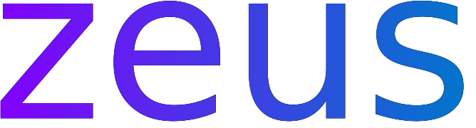

<br>

<p align="center">
 
</p>

<h3 align="center">
 
</h3>

<br>

<div align="center">

<a href="https://github.com/threadexio/zeus/releases/latest">
 
</a>
&nbsp;
<a href="https://github.com/threadexio/zeus/issues">
 
</a>
&nbsp;
<a href="https://github.com/threadexio/zeus/actions/workflows/build.yaml">
 
</a>
&nbsp;
<a href="https://github.com/threadexio/zeus/blob/master/LICENSE">
 
</a>
&nbsp;

</div>

<div align="center">
 
 &nbsp;
</div>

<br>
<br>

<h1>
  What is zeus?
</h1>

**zeus** is a simple AUR helper which utilizes containers allowing developers and users alike to benefit from it's reproducible, clean and flexible builds.

<h1>Contents</h1>

- [Features](#features)
- [Documentation](#documentation)
- [Installation](#installation)
	- [Install on ArchLinux](#install-on-archlinux)
	- [Install on other distros](#install-on-other-distros)
- [Getting started](#getting-started)
- [Why zeus?](#why-zeus)
	- [Everything builds in a container.](#everything-builds-in-a-container)
	- [You can ensure reliable builds](#you-can-ensure-reliable-builds)
- [License](#license)

# Features

<!-- TODO: Finish the readme -->

# Documentation

For everything you might need, visit the <a href="https://github.com/threadexio/zeus/wiki" target="_blank">docs</a>.

# Installation

## Install on ArchLinux

Use your other AUR helper to get one of these 2 packages.

<a href="https://aur.archlinux.org/packages/zeus" target="_blank">
 
</a>

<a href="https://aur.archlinux.org/packages/zeus-bin" target="_blank">
 
</a>

## Install on other distros

Zeus is build the mindset of using as few dependencies as possible, it only has 4 _real_ dependencies:

- [ ] A working computer
- [ ] A POSIX compatible filesystem (ext4, btrfs, xfs, ...)
- [ ] `systemd-sysusers`
- [ ] A supported container solution (docker)

# Getting started

Getting started with `zeus` is really easy. Just [install it](#installation) and choose your preferred supported container backend and install that too.

> NOTE: If you don't install a backend, you won't be able to build any packages.

After installing one you will have to configure `zeus` to use that one by default. Open `/etc/zeus/zeus.toml` perform the following changes.

**Important:** The backend you choose must have a runtime for zeus. The officially supported backends are:
- docker

```toml
...
[zeus]
...
# remove the '#' from the front of the following line
runtime = "<your backend>"
...
```

# Why zeus?

- [ ] Do you hate having messy packages leaving stray files?
- [ ] Do you maintain packages and want to ensure they will always build on a default system?
- [ ] Do you want an over-engineered AUR helper?

If you answered yes to any of the previous questions, then `zeus` might be of some use to you.

How can `zeus` help you?

## Everything builds in a container.

This means cleaning up your build environment is as easy as removing that container.

## You can ensure reliable builds

The container is just the base image. If your package doesn't build there, then it needs some tweaking.

# License

All source code for `zeus` is licensed under the [GNU General Public License Version 3](./LICENSE).

All art, logos, images found in this repository are licensed under the [Creative Commons Attribution-NonCommercial 4.0 International Public License](img/LICENSE).

Copies of these licenses can be found inside the respective directories.
