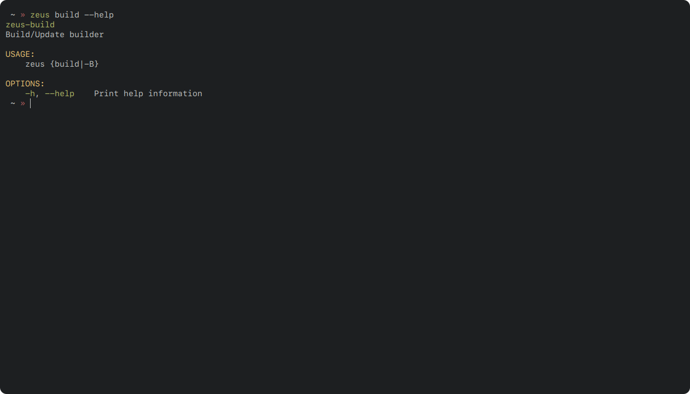
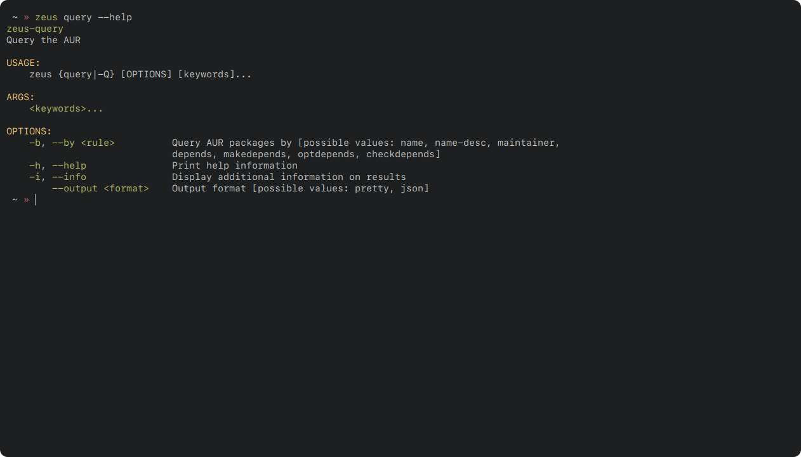

<div align="center">

  

  <h1>
  Ζεύς
  </h1>

  <h3>
  /zefs/
  </h3>

  [](https://github.com/threadexio/zeus/releases/latest)
  [](https://github.com/threadexio/zeus/actions/workflows/ci.yaml)
  [](https://aur.archlinux.org/packages/zeus)
  [](https://github.com/threadexio/zeus)

</div>

<h1>What is zeus?</h1>

**zeus** is a simple AUR helper which utilizes containers allowing developers and users alike to benefit from it's reproducible, clean and flexible builds.

* [Features](#features)
* [Security](#security)
* [Installation](#installation)
  * [Archlinux](#archlinux)
    * [AUR (Recommended)](#aur-recommended)
    * [pacman](#pacman)
  * [Other distros](#other-distros)
* [Usage](#usage)
  * [Building the builder](#building-the-builder)
  * [Sync](#sync)
  * [Remove](#remove)
  * [Query](#query)
* [Terminology](#terminology)
  * [Data directory](#data-directory)
  * [Build directory](#build-directory)
  * [Config file](#config-file)
  * [Runtimes](#runtimes)
* [License](#license)

# Features

* [x] 🏗 Consistent builds
* [x] 🧱 Build environment separation
* [x] 🛡️ Security from misbehaving build scripts (see [Security](#security))
* [x] 🌈 Colors
* [x] 🐚 Shell completions

# Security

<div style="border: 1px solid rgb(168, 0, 20); background: rgba(168, 0, 20, 0.25); padding: 10px;">

Zeus can _**NOT**_ protect you from malicious packages. It is only as good as the runtime used. For example, if you use `docker` with zeus then, all of the security risks associated with docker apply. And this is only for the build scripts.

A malicious actor that would want to cause damage would never use the build scripts to do so. They would instead use install scriptlets that are executed by `pacman` as root when the package is installed. This is not something zeus can prevent.

</div>

# Installation

## Archlinux

### AUR (Recommended)

If you already have another AUR helper it is highly recommended you choose this method over the other. The `zeus-bin` packages installs binaries built in GitHub Actions, you can view the build [here](https://github.com/threadexio/zeus/actions/workflows/ci.yaml). The **zeus** package gets the latest release and builds it locally on your machine.

[](https://aur.archlinux.org/packages/zeus)
[](https://aur.archlinux.org/packages/zeus-bin)

### pacman

Install the latest package from the [releases page](https://github.com/threadexio/zeus/releases/latest). If you do not know how to do that, it is best to follow the method above instead.

## Other distros

**zeus** is build the mindset of using as few dependencies as possible, it only has 4 _real_ dependencies:

* [x] A working computer
* [x] A POSIX compatible filesystem (ext4, btrfs, xfs, ...)
* [x] `systemd-sysusers`
* [x] A supported container solution

The tarball used for the arch package can be found in the [releases page](https://github.com/threadexio/zeus/releases/latest).

# Usage

Before you do anything, you must:

* make sure to have installed the framework you are going to use, for example docker. **zeus** does _not_ install it for you.
* have built the builder with: `zeus -B`

If you have done the above, you are good to go.

<div align="center">
  
</div>

## Building the builder

<div align="center">
  
</div>

> NOTE: You should rebuild the builder every time you update your main system in order to avoid dependency conflicts between host-builder.

## Sync

<div align="center">
  
</div>

## Remove

<div align="center">
  
</div>

## Query

<div align="center">
  
</div>

# Terminology

## Data directory

The data directory (`/usr/share/zeus`) holds anything **zeus** or its runtimes might need, for example, the docker runtime keeps there the Dockerfile that specifies how to builder container should be built. Inside that directory is also a program called `builder`, you should not run this program directly, instead it is there for runtimes to include inside the containers they build. This program is what actually builds everything inside the container.

## Build directory

The build directory is a directory with special permissions owned by the `zeus` user and it holds all of the synced packages. The default location for the build directory is `/var/cache/aur`. The build directory contains all information **zeus** needs. If you ever need to reset **zeus** you can do so by removing that directory and reinstalling the package, this will automatically setup the correct permissions, UIDs and GIDs.

## Config file

The configuration file, located at `/etc/zeus/zeus.toml`, contains the default options zeus will use. Most of the options in that file can be configured from the command line but for ease of use they are also loaded from this file. The file uses the `toml` configuration format, all configurable options can be found inside the file with comments describing what they do.

An options that is defined in the configuration file will always be overridden if it is also set in the command line. For example, if in the configuration file the options `zeus.color` is set to `never` and you run zeus something like this:

```bash
zeus --color always ...
```

Then `always` will override `never` that was set in the config file.

## Runtimes

Runtimes are how **zeus** can utilize different frameworks to build packages. A runtime a bit like a device driver, only it doesn't interface with hardware. Runtimes provide a simple interface for **zeus** that can:

* create a new image
* create a new container
* start/stop a container

And more. These fundamental operations are then combined to create the complex actions that are required.

Runtimes are packaged in with **zeus** and can be found in `/usr/lib/zeus/runtimes` as `.so` files, or shared objects. These files are loaded inside **zeus** and contain the code that provides the above interface. Runtimes follow the naming scheme: `librt_<name>.so`

One example runtime is the docker runtime that simply forwards operations to the docker program (`/usr/bin/docker`), just like the docker commands you run yourself, only a bit more complicated.

# License

All source code for **zeus** is licensed under the [GNU General Public License Version 3](./LICENSE).

All art, logos, images found in this repository are licensed under the [Creative Commons Attribution-NonCommercial 4.0 International Public License](img/LICENSE).

Copies of these licenses can be found inside the respective directories.
